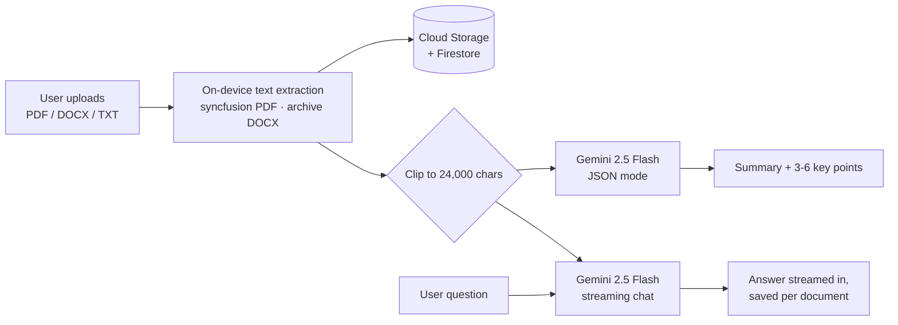

# Distill

> **Read less. Understand more.**

Distill is a Flutter app that summarizes documents with AI. Upload a **PDF**,
**DOCX**, or **TXT** file → get an AI-generated **summary** + **key points** →
**chat** with the document and ask follow-up questions.

---

## Features

- 📄 Upload **PDF / DOCX / TXT** (up to 50 MB).
- ✨ Auto-generated **summary + 3-6 key points** (Google Gemini 2.5 Flash, via Firebase AI Logic → Vertex AI).
- 💬 **Chat** with your document — answers stream in and are persisted per-document.
- 🔐 **Email/password** auth + per-user data isolation (Firestore + RTDB + Cloud Storage).
- 🌗 **Light / Dark** themes with a refined "digital study" palette; **navy splash** that runs edge-to-edge.
- 🛟 **Demo mode** runs offline with in-memory data + a stubbed AI — zero setup required.

## Tech Stack

| Layer | Choice |
|---|---|
| Framework | **Flutter 3.x** (Dart 3.10+) |
| State | **Riverpod v3** |
| Navigation | **go_router** |
| Auth + storage | **Firebase Auth, Cloud Firestore, Realtime Database, Cloud Storage** |
| AI | **Gemini 2.5 Flash** via **Firebase AI Logic — Vertex AI backend** |
| Local extraction | `syncfusion_flutter_pdf` (PDF) · `archive` (DOCX) · built-in (TXT) |
| Theming / icons | Google Fonts · Material Symbols · `flutter_animate` |
| Tests | `flutter_test` (60 tests), `mocktail`, `integration_test` |

Full architecture / file-by-file walkthrough: **[PROJECT_GUIDE.md](PROJECT_GUIDE.md)**.
Live-Firebase bring-up checklist: **[BACKEND_CHECKLIST.md](BACKEND_CHECKLIST.md)**.

---

## Quick start — demo mode (no Firebase required)

The app ships with `kFirebaseConfigured = false` in `lib/core/app_config.dart`,
so out of the box it runs entirely offline with in-memory repositories and a
stub AI service.

```bash
flutter pub get
flutter run            # pick any device (Chrome, an Android emulator, etc.)
```

You can sign up with any email/password, upload one of the included
`test_samples/` files, and watch the (fake) pipeline.

---

## Setup — live Firebase

To run against your own Firebase project (real Gemini, real cloud storage):

1. **Install the FlutterFire CLI**
   ```bash
   dart pub global activate flutterfire_cli
   ```
2. **Create a Firebase project** at <https://console.firebase.google.com>, then
   enable:
   - **Authentication** → Email/Password
   - **Cloud Firestore** (production mode)
   - **Realtime Database** (note the region — the app uses `europe-west1` by default)
   - **Cloud Storage**
   - **Firebase AI Logic** with the **Vertex AI** backend — *requires the
     **Blaze** (pay-as-you-go) billing plan* because the Gemini Developer API
     free tier returns `limit: 0` in some regions (see `PROJECT_GUIDE.md` §2.13).
3. **Generate `firebase_options.dart`** (the real file is `.gitignored`):
   ```bash
   flutterfire configure
   ```
   This drops `lib/firebase_options.dart` and the platform configs
   (`android/app/google-services.json`, `ios/Runner/GoogleService-Info.plist`)
   into your working tree. *None of these are committed.*
4. **Deploy the security rules** included in the repo:
   ```bash
   firebase deploy --only firestore:rules,database,storage
   ```
5. **Flip the live flag** in `lib/core/app_config.dart`:
   ```dart
   const kFirebaseConfigured = true;
   ```
   then `flutter run -d chrome` (or your emulator/device).

> **Android Google sign-in is intentionally hidden** (no Continue-with-Google
> button on the auth screens). Email/password is the supported live path. See
> `PROJECT_GUIDE.md` §2.15 for the rationale.

---

## How it works



Text is extracted **on the device**, so the AI sees plain text, not the raw file. Summaries use JSON mode so the
app can render the key points reliably, and chat reuses the same extracted text as context.

## Business impact

**Who it is for:** students, analysts, lawyers and consultants who have to work through documents faster than they can
read them.

An illustrative estimate, using assumptions you can swap for real figures:

| Assumption | Value |
|---|---|
| Typical document | 6-page report ≈ 3,500 words (fits the 24,000-character context) |
| Reading speed | 238 words/min → **≈ 15 min** to read in full |
| Reading the summary + key points (~300 words) | **≈ 1.5 min** |
| Team | 10 people × 5 documents/day |

**≈ 13 minutes saved per document → ≈ 11 hours a day across the team** to spend on deciding rather than reading, plus
follow-up questions answered from the document itself instead of a re-read.

**Before using it on long documents:** the app currently sends only the **first 24,000 characters** (about 4,000 words)
to the model. A 30-page contract would be summarised from its first few pages, so the time saving above only holds
for documents within that limit. The next step is chunked map-reduce summarisation, then labelling which pages each
key point came from so readers can check the source.

## Testing

```bash
flutter analyze       # 0 issues
flutter test          # 60 tests
```

Sample files for manual testing live in **`test_samples/`** — drag them into
an emulator to exercise the upload → summary → key-points → chat flow.

---

## Security & secrets

Distill never stores private credentials in source control. The following are
**`.gitignored`** so they cannot be committed accidentally:

| File | Why |
|---|---|
| `lib/firebase_options.dart` | Contains your project's API keys + identifiers. Regenerated locally by `flutterfire configure`. |
| `android/app/google-services.json` | Android Firebase config (per-project). |
| `ios/Runner/GoogleService-Info.plist` | iOS Firebase config (per-project). |
| `.firebaserc`, `.firebase/`, `*-debug.log` | Firebase CLI state and logs. |
| `*.keystore`, `*.jks`, `key.properties` | Android signing keys. |
| `.env`, `.env.*` | Defensive (no `.env` is used today). |

A sanitized template is committed at **`lib/firebase_options.dart.example`** —
copy it to `firebase_options.dart` and fill in your own values, or just run
`flutterfire configure` to auto-generate.

The repo does not contain: signing keystores, service account JSON,
`.env` files, or any access tokens.

---

## Project layout

```
lib/
  core/             theme, routing, DI, AI service abstraction, constants
  features/
    auth/           sign-in, sign-up, forgot-password, profile
    documents/      home, upload, processing, document detail
    chat/           per-document chat
    onboarding/     splash + onboarding pages
    profile/        profile, settings, edit profile
  shared/           reusable widgets and services (file picker, text extraction)
android/   ios/   web/      platform shells
test/                       unit + widget tests
integration_test/           on-device E2E
test_samples/               sample TXT/DOCX for manual testing
```

---

## License

For portfolio use. Reach out before reusing in commercial work.
